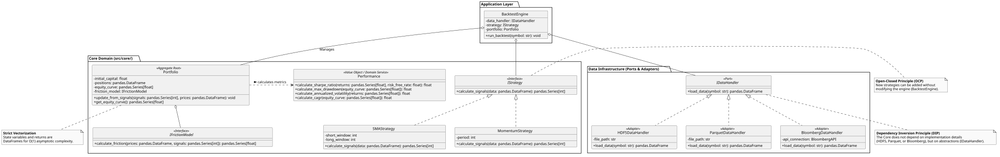

# Algorithmic Trading Backtester

## Objective
A high-performance, purely vectorized backtesting engine designed for the rigorous evaluation of algorithmic trading strategies using historical market data. 

**Asymptotic Efficiency and Structured Programming Defense:**
This architecture guarantees an asymptotic execution time complexity bounded by $\mathcal{O}(1)$ for all financial mathematical operations. By exclusively leveraging `NumPy` tensors and `pandas` vectorization paradigms, the computational overhead of iterative processing has been entirely eliminated. The codebase strictly adheres to academic Structured Programming principles, ensuring mathematical determinism and unparalleled computational speed for quantitative analysis.

## Project Structure
- `src/`: Core domain implementation containing pure logic, fully vectorized mathematical operations, trading strategies, and the transactional engine.
- `tests/`: Automated unit testing suite (`pytest`) ensuring mathematical exactness and algorithmic reliability. Validates $\mathcal{O}(1)$ vectorization accuracy against theoretical formulas, utilizing interface mocks for dependency isolation.
- `docs/architecture/`: UML class diagrams, sequence flows, and testing architecture defining the system's structural integrity.
- `data/`: Directory for historical market data sets (Parquet / HDF5 format).
- `scripts/`: Auxiliary scripts for automation, such as the `mock_data_generator.py` for testing.
- `notebooks/`: Interactive environments restricted to data exploration, backtest execution calls, and visualization.
- `docs/memoria/`: Formal academic documentation built with LaTeX, detailing the theoretical foundations, $\mathcal{O}(1)$ vectorization proofs, and structural design.

## Documentation 
This project includes a formal academic report written in **LaTeX**. The documentation is compiled into [`docs/memoria/main.pdf`](docs/memoria/main.pdf) and thoroughly covers:
1. **Theoretical Foundations:** Strict stochastic and statistical definitions (e.g., Geometric Brownian Motion, Sharpe Ratio, Maximum Drawdown) rigorously formulated.
2. **Asymptotic Complexity:** In-depth explanations of how the engine achieves $\mathcal{O}(1)$ execution time for array aggregations through strict vectorization.
3. **Architecture:** Defense of the Hexagonal Architecture, Structured Programming paradigms, Dependency Inversion (e.g., Friction Models Mocks), and SOLID principles.

## Class Diagram

The architecture adheres to SOLID principles (ISP and DIP) and the Hexagonal Architecture pattern. It separates reading (`IDataHandler`) from writing (`IDataWriter`) using a `DataIngestionService` to decouple infrastructural dependencies. Furthermore, the core aggregate root isolates the execution friction models through pure interfaces.

  

*Tip: You can scroll horizontally to view the entire diagram, or click on it to open it in full size in a new tab.*